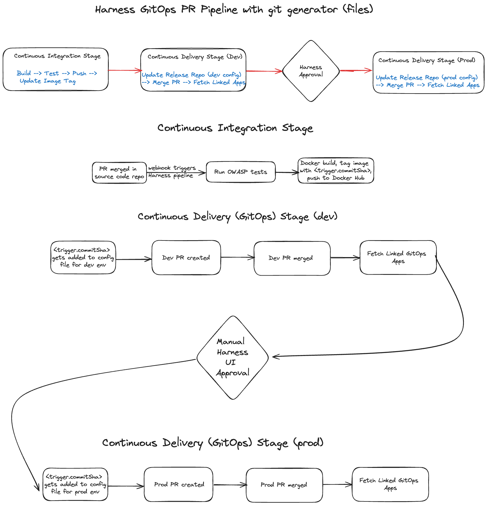

# harness-gitops-workshop

In this workshop, we'll use the Harness CI, CD, and GitOps modules to demonstrate an end-to-end software delivery process - from build to deployment following GitOps principles. 

## Pre-requisites

- A Harness free plan. If you don't have one, [sign up for free](https://app.harness.io/auth/#/signup/?&utm_campaign=cd-devrel).
- A GitHub account. [Fork the Harness GitOps repo](https://github.com/dewan-ahmed/harness-gitops-workshop/fork)
- A Docker Hub account. However, any other image registry will also suffice.
- A Kubernetes cluster. A setup like [k3d](https://k3d.io/) will be suitable.

## Required setup and configurations

In order to interact with your code repository (GitHub) and image registry (Docker Hub), the Harness platform needs to authenticate to these providers on your behalf. [Connectors](https://developer.harness.io/docs/first-gen/firstgen-platform/account/manage-connectors/harness-connectors/) in Harness help you pull in artifacts, sync with repos, integrate verification and analytics tools, and leverage collaboration channels.

In this section, you'll create two secrets and two connectors for GitHub and Docker Hub. But before that, you'll need to create two personal access tokens (PAT) for GitHub and Docker Hub. Check out [the GitHub docs](https://docs.github.com/en/authentication/keeping-your-account-and-data-secure/managing-your-personal-access-tokens) and [the Docker Hub Docs](https://docs.docker.com/security/for-developers/access-tokens/) on how to create personal access tokens. For GitHub, you need to ensure that the token has read/write access to the content, pull requests (PRs), and webhooks for your forked repository.

From your project setup, click on **Secrets**, then **+ New Secret**, and select **Text**. Use the Harness Built-in Secrets Manager. Give this secret a name `github_pat` and paste in the Personal Access Token (PAT) for GitHub. Similarly, create an access token for Docker Hub and name it `docker_secret`.

Now, let's create connectors for GitHub and Docker Hub. From your project setup, click on **Create via YAML Builder**, then paste in contents of [github-connector.yaml](cli-manifests/github-connector.yaml) (remember to replace **YOUR_HARNESS_ACCOUNT_ID** and **YOUR_GITHUB_USERNAME**). Similarly, create a Docker Hub connector following [docker-connector.yaml](cli-manifests/docker-connector.yaml) (remember to replace **YOUR_HARNESS_ACCOUNT_ID** and **YOUR_DOCKER_USERNAME**).

## Build the CI stage

## Create the ApplicationSet 

## Create the PR Pipeline

## Test the setup
